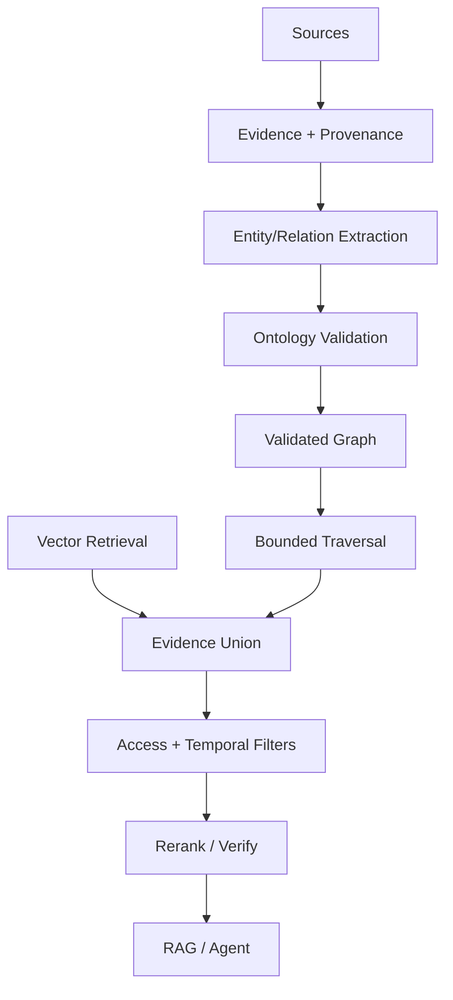

# Module 31 — Architecture Diagram Source

```mermaid
flowchart TD
 S[Sources] --> E[Evidence + Provenance]
 E --> X[Entity/Relation Extraction]
 X --> O[Ontology Validation]
 O --> G[Validated Graph]
 G --> T[Bounded Traversal]
 V[Vector Retrieval] --> U[Evidence Union]
 T --> U
 U --> A[Access + Temporal Filters]
 A --> R[Rerank / Verify]
 R --> Q[RAG / Agent]
```

Security rule: authorization and policy are external to graph semantics.