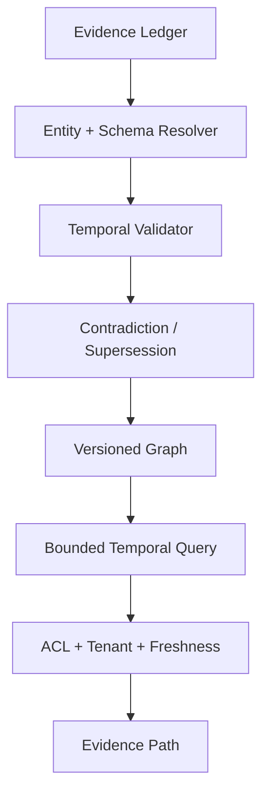

# Module 32 — Architecture Diagram Source

```mermaid
flowchart TD
 S[Evidence Ledger] --> R[Entity + Schema Resolver]
 R --> T[Temporal Validator]
 T --> C[Contradiction / Supersession]
 C --> G[Versioned Graph]
 G --> Q[Bounded Temporal Query]
 Q --> F[ACL + Tenant + Freshness]
 F --> E[Evidence Path]
```

Historical queries must use validity semantics; audit queries must retain transaction history.