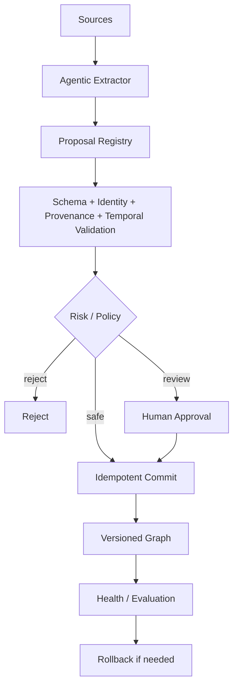

# Module 33 — Architecture Diagram Source

```mermaid
flowchart TD
 S[Sources] --> A[Agentic Extractor]
 A --> P[Proposal Registry]
 P --> V[Schema + Identity + Provenance + Temporal Validation]
 V --> D{Risk / Policy}
 D -->|reject| X[Reject]
 D -->|review| H[Human Approval]
 D -->|safe| C[Idempotent Commit]
 H --> C
 C --> G[Versioned Graph]
 G --> M[Health / Evaluation]
 M --> B[Rollback if needed]
```

Model output is a proposal, never direct graph authority.