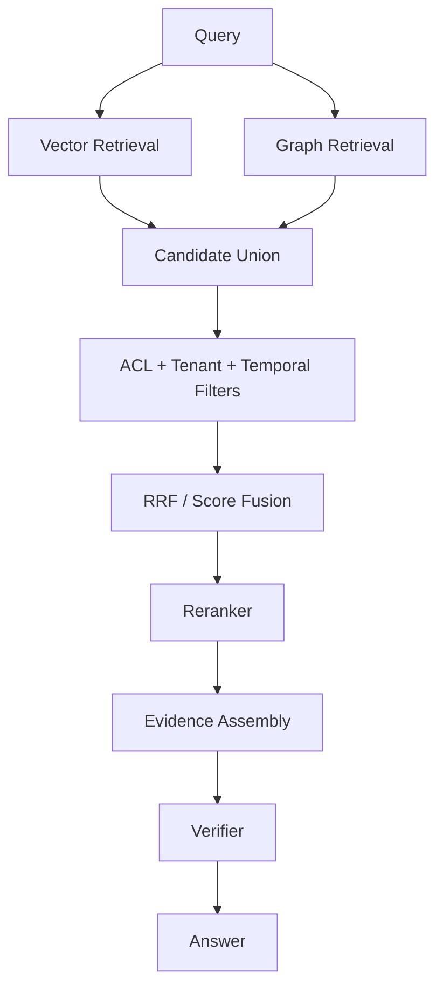

# Module 34 — Architecture Diagram Source

```mermaid
flowchart TD
 Q[Query] --> V[Vector Retrieval]
 Q --> G[Graph Retrieval]
 V --> U[Candidate Union]
 G --> U
 U --> A[ACL + Tenant + Temporal Filters]
 A --> F[RRF / Score Fusion]
 F --> R[Reranker]
 R --> E[Evidence Assembly]
 E --> Z[Verifier]
 Z --> O[Answer]
```

Measure every stage; do not assume hybrid is better.